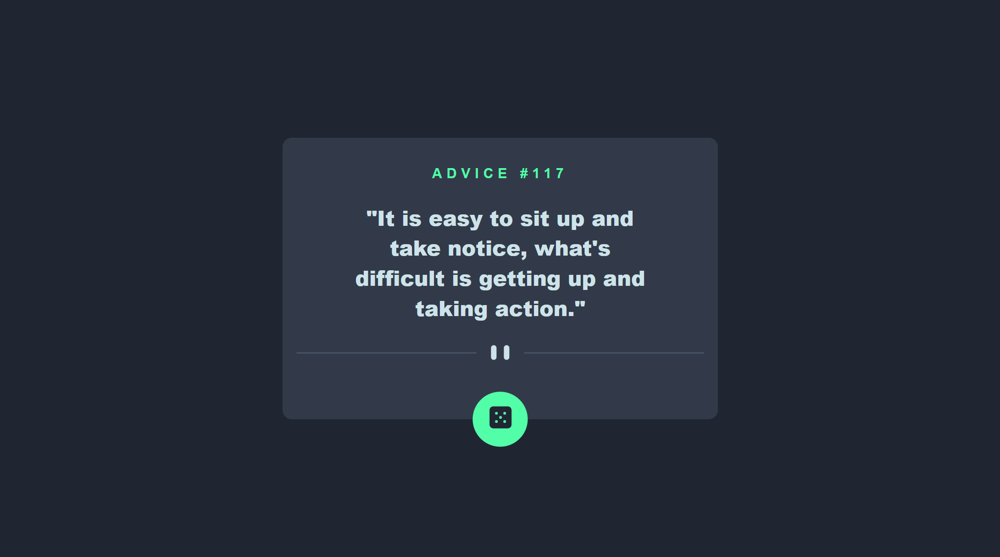

# Frontend Mentor - Advice generator app solution

Esta é uma solução para o [Advice generator app challenge on Frontend Mentor](https://www.frontendmentor.io/challenges/advice-generator-app-QdUG-13db). 

## Table of contents

- [Visão geral](#visão-geral)
  - [Screenshot](#screenshot)
  - [Links](#links)
- [Meu processo](#meu-processo)
  - [Construído com](#construído-com)
  - [O que eu aprendi](#o-que-eu-aprendi)
  - [Desenvolvimento contínuo](#desenvolvimento-contínuo)
- [Autor](#autor)


## Visão geral

### Screenshot




### Links

- Live Site URL:  [Advice generator app solution live](https://isabela-fernanda.github.io/Advice-generator-app-solution/)
## Meu processo

### Construído com

- Semantic HTML5 markup
- CSS custom properties
- Flexbox
- CSS Grid
- JS commands
- API → [Advice Slip API](https://api.adviceslip.com)

### O que eu aprendi

Neste projeto foi a primeira vez que eu trabalhei com API e trabalhei mais com funções assíncronas e try-catch no JS.

Alguns dos pontos que mais se destacam pra mim no meu código são:

```js
async function gerarConselhoAleatorio(){
    try{
        const url = "https://api.adviceslip.com/advice"
    const resposta = await fetch(url)
    return await resposta.json()

    }catch{
        console.log("Erro ao gerar conselho:", erro)
    }finally{
        console.log("Processo 1 encerrado.")
    }
}
```
```js

async function tirarUmConselhoAleatorio() {
    try{
const conselhos = await gerarConselhoAleatorio()
    const textoConselho = conselhos.slip.advice
    const idConselho = conselhos.slip.id
    document.getElementById('advice-text').textContent = '"' + textoConselho + '"'
    document.getElementById('advice').textContent = "ADVICE #" + idConselho;
    }catch(erro){
        console.error("Erro ao tirar conselho:", erro)
    }finally{
        console.log("Processo 2 encerrado.")
    }
}
```

### Desenvolvimento contínuo

Planejo continuar focando em projetos de JS com API. 

## Autor

- Frontend Mentor - [@Isabela-Fernanda](https://www.frontendmentor.io/profile/Isabela-Fernanda)